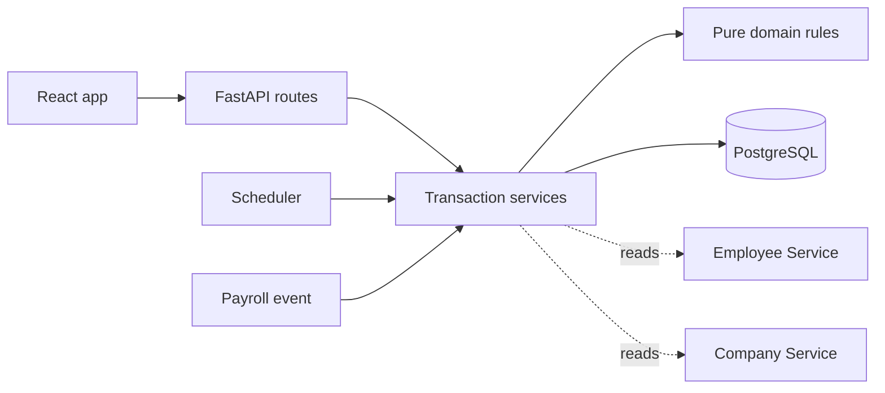

# Employee Time Off Tracking

A focused take-home implementation for policy-based time-off accrual, requests,
approvals, and auditable balance changes.

## Run locally

Requirements: Python 3.13, Node.js, Docker, and Docker Compose.

```bash
make install
make up
make migrate
```

Then run `make api` and `make web` in separate terminals. The API is available
at <http://localhost:8000> and the web app at <http://localhost:5173>.

```bash
make test   # backend and frontend tests
make lint   # Python lint
```

## Architecture



The solution is one modular service and one database. Domain functions own
date and policy rules; services own transactions and integration calls. The
take-home uses deterministic adapters for the existing Employee, Company, and
Payroll services.

## Assumptions

- Monday-Friday, eight-hour days are the default.
- Employee Service owns schedules, start dates, and roles.
- Company Service owns company settings and timezone.
- Payroll publishes an `on_payroll_processed` event with minutes worked.
- Authentication is represented by an actor header; authorization remains
  enforced in the API.

## Planned core entities

Policies are effective-dated and assigned to arbitrary employee groups.
Balances are derived from an append-only ledger. Submitted requests freeze the
working dates and minutes they consume, while request events preserve every
state transition. Each entity is introduced in the same PR as its behavior.
