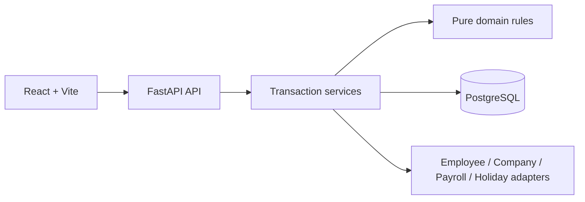
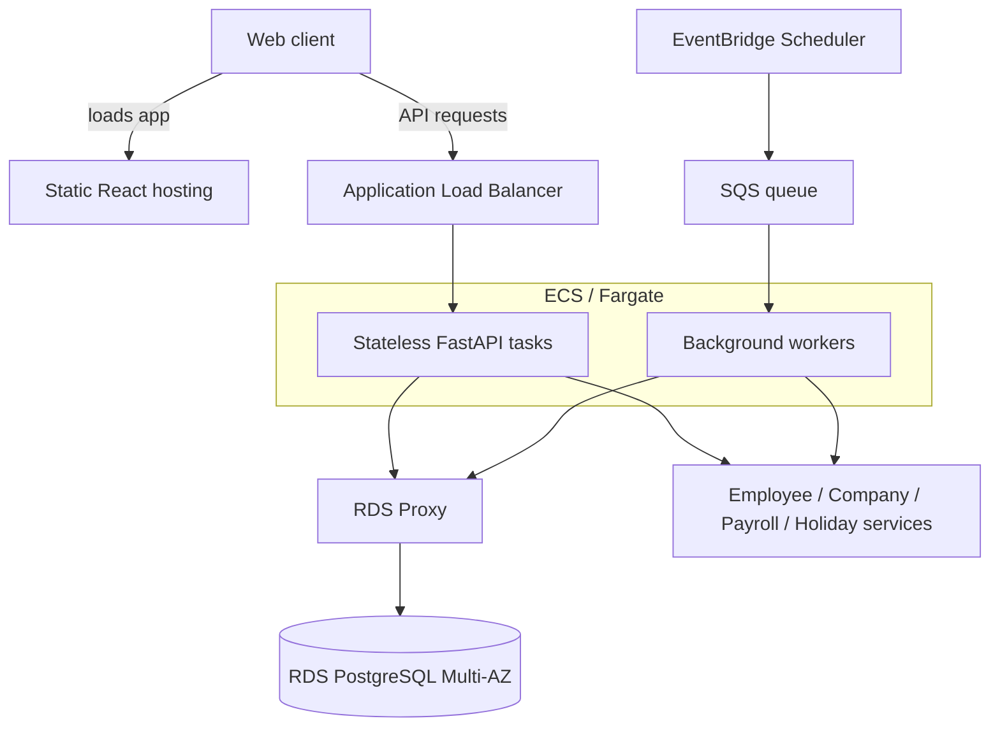

# Employee Time Off Tracking

A compact, production-minded implementation of time-off policies, accruals, requests, approvals, and audit history. The repository favors a small understandable system: one React app, one FastAPI modular monolith, and one PostgreSQL database.

## Two-minute overview

Time is accounted for in integer minutes through an append-only ledger. Policies are effective-dated versions, requests freeze their calculated workdays, approvals run transactionally, and cancellations add compensating entries instead of rewriting history.

| Requirement | Where it lives |
| --- | --- |
| Employee and company boundaries | Deterministic adapters in [`backend/app/integrations`](backend/app/integrations) |
| Policy definitions and arbitrary assignments | Versioned policy and assignment services; [service flows](backend/app/services/DESIGN.md) |
| Scheduled and payroll accrual | Idempotent accrual entry points; [service flows](backend/app/services/DESIGN.md#accrual-flows) |
| Balances and auditability | Ledger-derived balances; [data model](backend/app/models.md) |
| Employee requests and admin approvals | Frozen days, holds, row locks, debit/reversal; [request flow](backend/app/services/DESIGN.md#request-flow) |
| Roles and company isolation | Server-side dependencies and scoped queries; [API boundary](backend/app/api/DESIGN.md) |
| Reviewer experience | Seeded story, demo clock, named edge cases, generated contracts, and CI |

## High-level design



- API routes validate identity and input; services own transactions; domain modules perform calculations.
- PostgreSQL constraints, row locks, and deterministic source keys protect accounting invariants.

## Documentation map

Detailed documentation is kept beside the code it describes.

| Topic | Co-located guide | Best starting question |
| --- | --- | --- |
| Database schema | [`backend/app/models.md`](backend/app/models.md) | Which records are authoritative, cached, or append-only? |
| Pure business rules | [`backend/app/domain/DESIGN.md`](backend/app/domain/DESIGN.md) | Which calculations are deterministic and side-effect free? |
| Business transactions | [`backend/app/services/DESIGN.md`](backend/app/services/DESIGN.md) | How do accrual, approval, and reversal work? |
| HTTP and authorization | [`backend/app/api/DESIGN.md`](backend/app/api/DESIGN.md) | Who can call each route family? |
| External boundaries | [`backend/app/integrations/DESIGN.md`](backend/app/integrations/DESIGN.md) | What is demo data, and what changes in production? |
| Migration history | [`backend/migrations/README.md`](backend/migrations/README.md) | Which behavior introduced each schema change? |
| Web application | [`frontend/src/DESIGN.md`](frontend/src/DESIGN.md) | What does each role see and how does data move? |
| Edge-case contract | [`docs/edge-cases.md`](docs/edge-cases.md) | What is handled, decided, or deferred? |
| Five-minute walkthrough | [`docs/demo-script.md`](docs/demo-script.md) | How can I review the product without editing data? |
| Generated API contract | [`docs/openapi.json`](docs/openapi.json) | What is the exact request/response surface? |

## Run locally

Requirements: Docker, Python 3.13+, Node.js 22+, and `make`.

```bash
make install
make up
make migrate
make seed
```

Start the API and web app in separate terminals:

```bash
make api
make web
```

Open [http://localhost:5173](http://localhost:5173). FastAPI runs at [http://localhost:8000](http://localhost:8000), and PostgreSQL uses port `5433`.

Run the same quality gate used by CI:

```bash
make check
```

It runs both test suites, backend and frontend lint, TypeScript checking, a production build, and OpenAPI/TypeScript contract generation. CI also rejects stale generated artifacts.

## Load-bearing decisions

| Decision | Consequence |
| --- | --- |
| Ledger instead of mutable balances | Every credit, debit, expiry, and reversal stays explainable. |
| Immutable policy versions | A new effective date cannot rewrite the reason for an old balance. |
| Frozen request days | Later calendar or policy changes do not silently reprice a request. |
| Minutes as the accounting unit | Six-hour and eight-hour workdays remain exact without floating-point days. |
| Injected external boundaries | Demo fixtures are deterministic; production integrations can replace adapters. |

## Scope and scaling

The synchronous modular monolith is deliberate. At higher volume, the same idempotent services can run in queue-backed workers without replacing the ledger as the source of truth.

### Target production architecture

This is a right-sized production target, not infrastructure currently shipped by this repository. It keeps the modular monolith and adds only the components needed to scale API traffic and background jobs independently.



#### Expected workload

The system should be read-heavy overall, with predictable write bursts. The ratio is an input to measurement—not an automatic reason to add replicas or shards.

| Workload | Expected shape | Consistency and scaling decision |
| --- | --- | --- |
| Balance, policy, and request views | Frequent small reads | Use indexed primary reads first; balances need read-after-write consistency. |
| Requests and approvals | Infrequent writes | Keep each state change and its ledger entries in one primary transaction. |
| Scheduled and payroll accruals | Bursty batched writes | Queue by company or employee, bound concurrency, and preserve idempotency. |
| Audit and reporting | Growing, scan-heavy reads | Paginate and index first; move stale-tolerant queries to a replica or projection later. |
| Ledger history | Append-heavy over time | Partition the table when index, vacuum, or retention costs become material. |

| Baseline component | Why it belongs |
| --- | --- |
| Static frontend hosting | Serves the small compiled React application without consuming API capacity. |
| Load balancer and stateless API tasks | Spread requests across healthy instances and scale horizontally without session affinity. |
| SQS and workers | Keep accrual runs and integration retries away from interactive request paths. |
| RDS Proxy and Multi-AZ PostgreSQL | Control connection bursts while retaining transactional ledger guarantees and database failover. |

Add the following only after traffic, reliability requirements, or measurements justify them:

| Later addition | Trigger |
| --- | --- |
| CDN | Users are geographically distributed or static-asset latency becomes material. |
| WAF | Internet exposure, compliance, or observed attacks require managed filtering beyond application controls. |
| Read replica or projections | Stale-tolerant audit and reporting reads create sustained primary contention. |
| Transactional outbox | A committed user action must atomically guarantee later asynchronous delivery. |
| Cache | Measured repeated reads cannot be served efficiently by database indexes or projections. |
| Database sharding | A partitioned, well-tuned primary still cannot sustain write volume; shard by company to retain transaction boundaries. |

- Partition background work by company or employee and retain the existing idempotency keys for safe retries.
- Keep PostgreSQL as the accounting source of truth; do not split domain transactions into services prematurely.

Production SSO, live payroll webhooks, notifications, distributed scheduling, and partial time spread over several dates are intentionally deferred. Reasons and extension points are recorded in the [edge-case contract](docs/edge-cases.md).

## Fifteen-minute review path

1. Read this page and the [data model](backend/app/models.md).
2. Follow the [policy, accrual, and request flows](backend/app/services/DESIGN.md).
3. Check the [API access matrix](backend/app/api/DESIGN.md) and [frontend role map](frontend/src/DESIGN.md).
4. Trace named tests from the [edge-case contract](docs/edge-cases.md).
5. Run the [five-minute demo](docs/demo-script.md) and `make check`.
