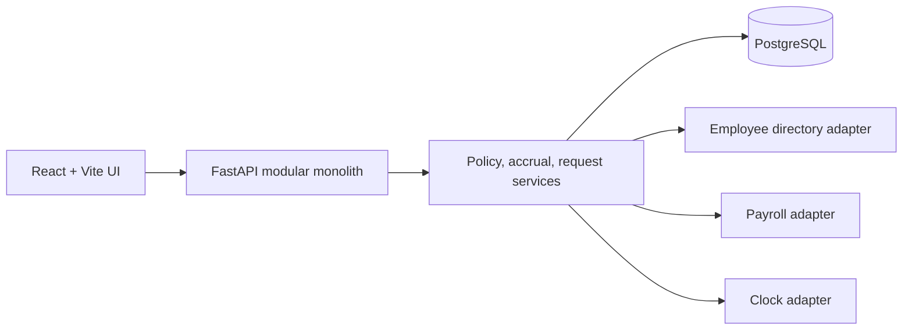
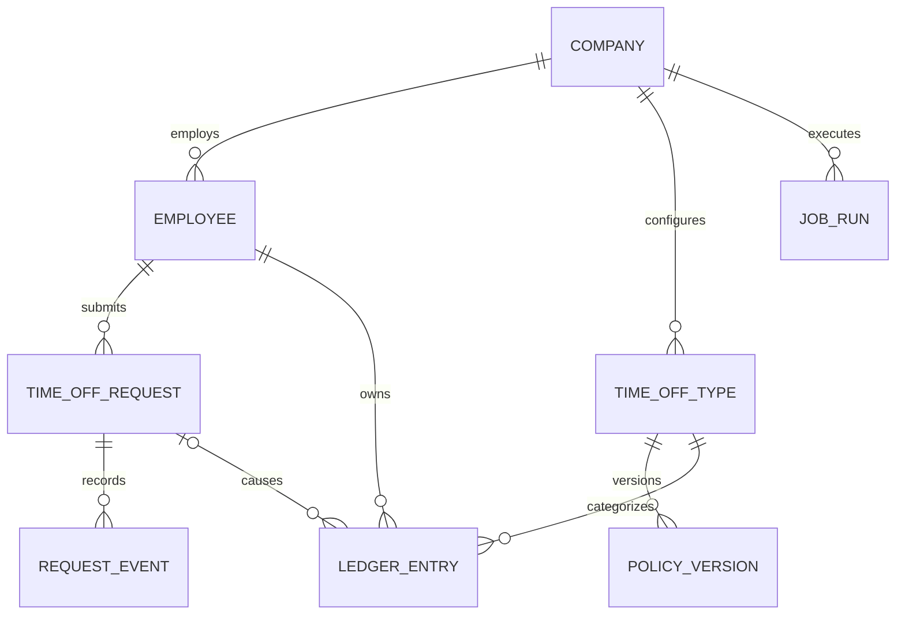
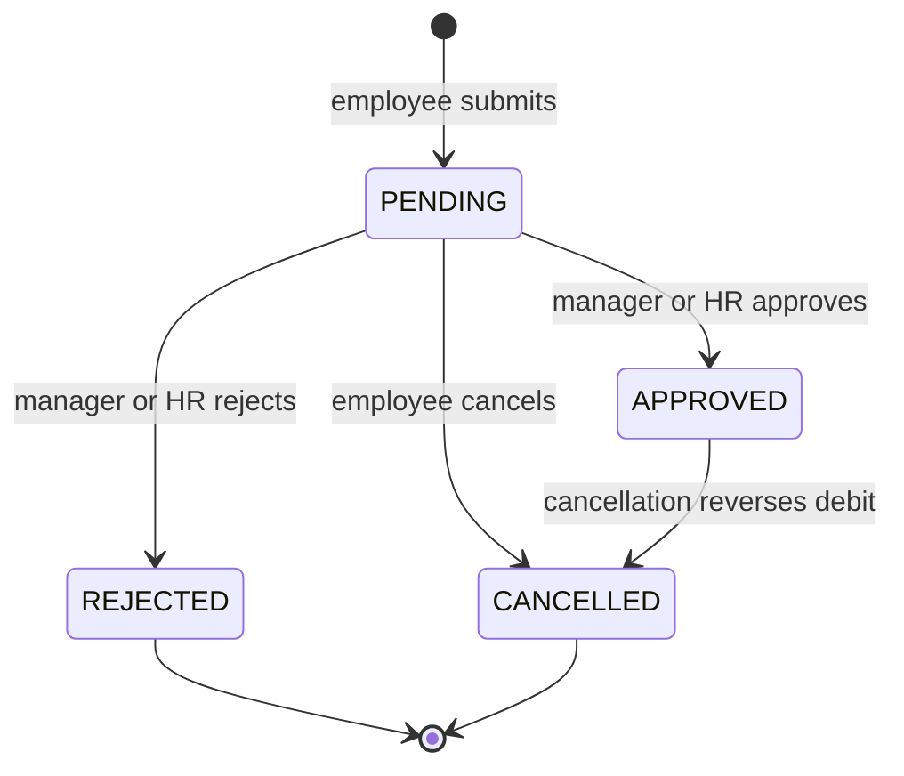

# Employee Time Off Tracking

A compact, production-minded reference implementation for employee time-off policy, accrual, requests, approvals, and auditability. It is intentionally a modular monolith: the accounting rules stay explicit and testable without introducing distributed-system machinery before it is needed.

## Two-minute executive summary

The application turns time-off into an auditable ledger rather than a mutable balance. Policies are versioned, requests freeze their calculated days, approvals debit the ledger transactionally, and reversals append compensating entries. Scheduled and payroll-driven accruals share idempotency rules, while company scoping and manager/HR permissions are enforced by the API.

The demo includes:

- Vacation and maternity time-off types, employees with different working-day lengths, and an observed holiday.
- Policy tiers, carryover, caps, expiration, negative-balance controls, and cross-year requests.
- Employee, manager, and HR views with request history, policy history, ledger totals, and job-run status.
- A controllable demo clock so reviewers can exercise date-sensitive behavior deterministically.

### Requirements at a glance

| Capability | Implementation and evidence |
| --- | --- |
| Employee directory | Company-scoped employees and manager relationships; seeded fixtures in `backend/app/integrations/employee_directory.py` |
| Time-off types and policies | Versioned policies with accrual cadence, tenure tiers, caps, carryover, expiry, and negative-balance rules |
| Scheduled and payroll accrual | Idempotent ledger entries and company-scoped job runs; covered by service tests |
| Requests and approvals | Frozen request days, pending holds, role-aware approval, cancellation, and cross-year debit/reversal |
| Auditability | Append-only ledger, policy versions, request events, and visible job history |
| Reviewer experience | Seeded demo, role switcher, demo clock, OpenAPI contract, generated frontend types, and CI gates |

## Run locally

Requirements: Docker, Python 3.13+, Node.js 22+, and `make`.

```bash
make install
make up
make migrate
make seed
```

Then start the API and web app in separate terminals:

```bash
make api
make web
```

Open [http://localhost:5173](http://localhost:5173). The API is at [http://localhost:8000](http://localhost:8000), with interactive docs at `/docs`. PostgreSQL is exposed on port `5433` to avoid colliding with a local default instance.

Run the complete local gate with:

```bash
make check
```

That command runs backend tests and lint, regenerates OpenAPI and TypeScript contracts, and checks frontend lint, types, and the production build. CI additionally fails if generated contract files are stale.

For a guided review, see [docs/demo-script.md](docs/demo-script.md). The explicit behavior register is in [docs/edge-cases.md](docs/edge-cases.md).

## Architecture



The backend uses three practical layers: HTTP routes validate and authorize, domain services own business rules and transactions, and SQLAlchemy models persist state. External employee-directory and payroll behavior sits behind small adapters. This keeps the rule-heavy core easy to test while leaving integration boundaries visible.

## Core data model



Balances are derived by summing ledger minutes. Policy and request histories are retained rather than overwritten, so a reviewer can reconstruct why any balance changed.

## Core flows

### Scheduled accrual

1. A company-scoped job selects active employees and the policy effective on the run date.
2. The service calculates minutes using the employee's working-day length, tenure tier, cadence, and cap.
3. A deterministic idempotency key prevents the same accrual period from being posted twice.
4. The ledger entry and job outcome commit together; reruns remain safe and visible.

### Payroll accrual

1. A payroll event enters through the adapter with an external event identifier.
2. The policy converts eligible worked minutes into accrued time and applies the balance cap.
3. The external identifier becomes part of the uniqueness boundary, making retries idempotent.
4. The resulting ledger entry is immediately reflected in the derived balance and audit view.

### Request state machine



Submission freezes the requested workdays and reserves available time. Approval converts that hold into one or more ledger debits, split by policy year when necessary. Cancelling an approved request appends matching reversal entries.

## Five load-bearing decisions

1. **Ledger over balance columns.** An append-only minute ledger preserves causality, supports compensating reversals, and makes balance calculation independently verifiable.
2. **Immutable policy history.** Editing a policy creates a new effective version, preventing today's configuration from rewriting yesterday's explanation.
3. **Frozen request calculation.** Workdays and minutes are stored at submission so later holiday, schedule, or policy edits do not silently change an in-flight request.
4. **Minutes as the accounting unit.** Employee-specific working-day lengths remain exact without floating-point day arithmetic; the UI converts minutes into readable days and hours.
5. **Injected boundaries.** Directory, payroll, and clock adapters make external data and time deterministic in tests and replaceable in production.

## API and security boundary

Every business query is company-scoped. The API derives the acting employee from `X-Actor-Id` for the local demo and checks employee, manager, or HR authority server-side; changing the UI role alone cannot grant access. Production would replace this header with verified identity claims while retaining the same authorization checks.

The canonical API contract is generated to `docs/openapi.json`, with TypeScript declarations in `frontend/src/api/schema.d.ts`:

```bash
make contracts
```

## Tradeoffs and scaling path

PostgreSQL transactions, row locking, uniqueness constraints, and deterministic keys provide correctness for the current single-service deployment. A synchronous job endpoint is sufficient for the demo and keeps failure behavior observable.

At higher volume, the same domain services can run behind a queue. An outbox would publish committed work, workers would claim company or employee partitions, and job-run records would remain the operational control plane. Read replicas or materialized balance projections can accelerate reporting without changing the ledger as source of truth.

The project deliberately defers production SSO, payroll webhooks, email/Slack notifications, partial-day requests, multi-currency payroll concerns, and a distributed scheduler. These are recorded with intended extension points in [docs/edge-cases.md](docs/edge-cases.md).

## Reviewer path

1. Follow [docs/demo-script.md](docs/demo-script.md) for the five-minute product tour.
2. Read the SQLAlchemy models and Alembic migrations for invariants and history.
3. Trace policy, accrual, and request services for transaction boundaries.
4. Use the named tests in [docs/edge-cases.md](docs/edge-cases.md) as executable evidence.
5. Run `make check` to reproduce the complete quality gate.
