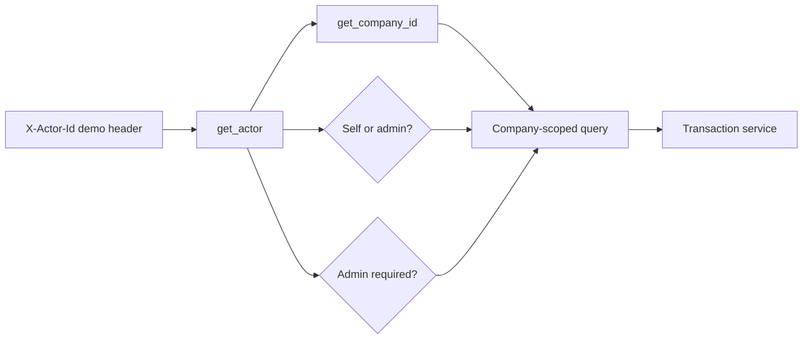
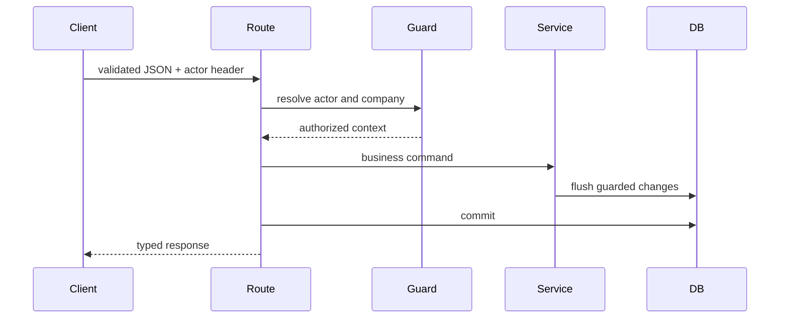

# API and authorization boundary

Routes in this directory translate HTTP input into service calls. They enforce identity and company scope before business data reaches a transaction service.

## Request boundary

- The header is a deterministic demo identity, not production authentication.
- Production replaces actor resolution with verified claims; route authorization stays server-side.

## Access matrix

| Route family | Employee | Admin | Scope |
| --- | --- | --- | --- |
| `/api/employees` | Read demo directory | Read demo directory | Company adapter |
| `/api/categories`, `/api/policies` | Read | Read and write | Company |
| `/api/groups`, `/api/groups/{id}/members` | Forbidden | Create, update, and remove | Company + group |
| `/api/policies/{id}/audience` | Forbidden | Set all employees or selected groups | Company + policy |
| `/api/policies/{id}/assignments` | Forbidden | Read and write | Company + policy |
| `/api/employees/{id}/assignments` | Self | Read | Company + employee |
| `/api/employees/{id}/balances` | Self | Any company employee | Employee + company |
| `/api/employees/{id}/ledger` | Self | Any company employee | Employee + optional policy |
| `/api/requests` | Preview, submit, read/cancel own | Read and act for company | Employee + company |
| `/api/requests/{id}/approve` or `deny` | Forbidden | Allowed | Company + request |
| `/api/holidays` | Read | Read, write, and sync | Company |
| `/api/audit/job-runs` | Forbidden | Read | Company |
| `/api/dev/state` | Read | Read | Development mode |
| `/api/dev/clock`, `accruals`, `rollover` | Forbidden | Demo clock and job triggers | Development mode |

## Route-to-service flow

| Outcome | HTTP behavior |
| --- | --- |
| Input shape is invalid | `422` with FastAPI validation details |
| Business rule rejects a command | `409` or `422` with a readable reason |
| Actor lacks authority | `403`; hiding a UI control is never the boundary |
| Company-scoped resource is absent | `404` without cross-company disclosure |

The generated source of truth is [`docs/openapi.json`](../../../docs/openapi.json). Regenerate it and the frontend declarations with `make contracts`.
