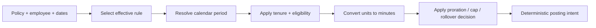

# Pure domain rules

Modules here turn explicit inputs into deterministic outputs. They do not open sessions, call APIs, read the clock, or commit transactions.

## Module map

| Module | Inputs | Output / decision |
| --- | --- | --- |
| [`units.py`](units.py) | Decimal amount, unit, employee day length | Exact integer minutes |
| [`periods.py`](periods.py) | Date and monthly/yearly cadence | Continuous calendar periods |
| [`accrual.py`](accrual.py) | Rate, period, eligibility, proration | Scheduled or payroll-earned minutes |
| [`rules.py`](rules.py) | Policy kind and accrual rules | Validated business configuration |
| [`requests.py`](requests.py) | Date range, workweek, holidays, partial minutes | Frozen charged dates and minutes |
| [`rollover.py`](rollover.py) | Year-end balance and policy settings | Explicit expiry and carryover legs |

## Calculation pipeline

| Boundary | Deliberate behavior |
| --- | --- |
| Month-end or leap-day hire | Calendar periods remain continuous and terminate. |
| Mid-period hire | Policy chooses prorated, full, or next-period accrual. |
| Tenure threshold inside a period | New tier starts at the next period boundary. |
| Weekend or holiday | Request day is omitted before cost is frozen. |
| Multi-date partial request | Rejected rather than guessing allocation. |
| Cross-year request | Frozen days are grouped by calendar year for debit/reversal. |

The transaction layer that persists these decisions is documented in [`services/DESIGN.md`](../services/DESIGN.md). Named boundary tests are indexed in [`docs/edge-cases.md`](../../../docs/edge-cases.md).
