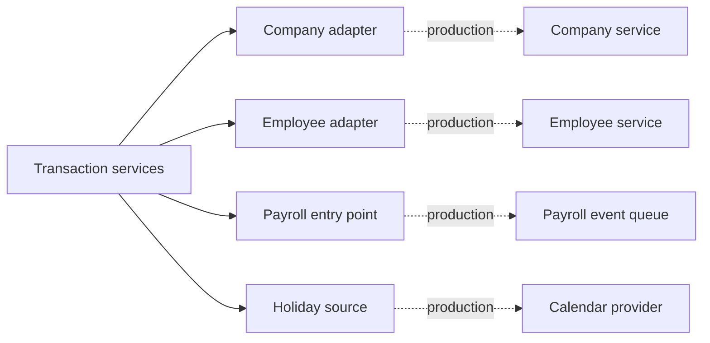

# External integration boundaries

The Employee, Company, and Payroll services are given assumptions in the take-home. Deterministic in-process adapters make the behavior runnable without redesigning those systems; production replaces only the adapter implementation.

## Boundary map

| Adapter | Demo responsibility | Production replacement |
| --- | --- | --- |
| [`company_service.py`](company_service.py) | Stable company identity | Verified tenant claim or company API |
| [`employee_service.py`](employee_service.py) | Employees, managers, hire dates, workday lengths | Employee-directory client with cache and timeouts |
| [`payroll_service.py`](payroll_service.py) | Deterministic payroll event fixture | Queue/webhook consumer calling the same idempotent service |
| [`holiday_source.py`](holiday_source.py) | Observed US holiday dates | Company calendar provider or HR configuration |

## Assumptions consumed

| Assumption | Value used here |
| --- | --- |
| Standard workday | Monday-Friday, 9am-5pm: five weekdays and 480 minutes. |
| Employee data | Read on demand from the Employee adapter; group memberships store stable IDs only. |
| Company data | Read on demand from the Company adapter. |
| `on_payroll_processed` | Adapted to an idempotent payroll-accrual command keyed by payroll run ID. |

Six-hour days are an intentional bonus case. The same Employee adapter supplies `work_days` and `work_minutes_per_day`, so request and accrual math does not create a second scheduling source.

## Ownership rules

| Data | Owner | Local persistence |
| --- | --- | --- |
| Company identity | Company service | Stable company ID references only |
| Employee profile and schedule | Employee service | Stable employee ID references only |
| Payroll run and worked minutes | Payroll system | Source IDs and resulting ledger entries |
| Company holidays | Time-off domain after sync | Company/date/name snapshot |
| Demo date | Local reviewer tooling | One `demo_state` row; never a production clock |

- Retries are expected: payroll and holiday entry points are idempotent or upsert-like.
- Authentication, transport retries, metrics, and circuit breaking belong in production adapters.
