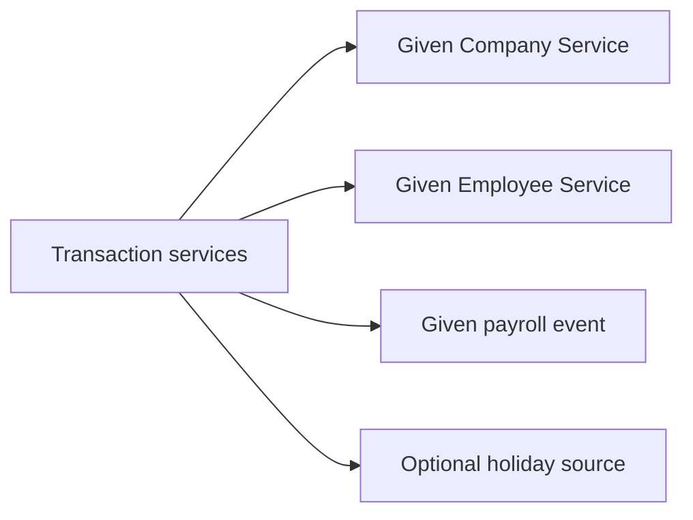

# External integration boundaries

The Employee, Company, and Payroll services are given assumptions. Their internals are out of scope; the application assumes they provide the data below. Deterministic local adapters only make the take-home runnable.

## Boundary map

| Local seam | Demo fixture | Assumed production input |
| --- | --- | --- |
| [`company_service.py`](company_service.py) | Stable company identity and settings | Company Service response |
| [`employee_service.py`](employee_service.py) | Employees, hire dates, schedules, groups, and memberships | Employee Service response |
| [`payroll_service.py`](payroll_service.py) | Deterministic payroll event | `on_payroll_processed`, including its run ID and worked minutes |
| [`holiday_source.py`](holiday_source.py) | Observed US holidays | Company-configured calendar data; this is a bonus boundary, not a given service |

The default schedule is Monday-Friday, 9am-5pm. Custom day lengths use the same Employee Service data. Payroll run IDs feed the time-off ledger's idempotency key; all other delivery details remain outside this design.

Employee groups and memberships are projected into local tables so policy eligibility can be demonstrated and constrained. In production, Employee Service remains authoritative and changes trigger the same assignment-reconciliation logic.
