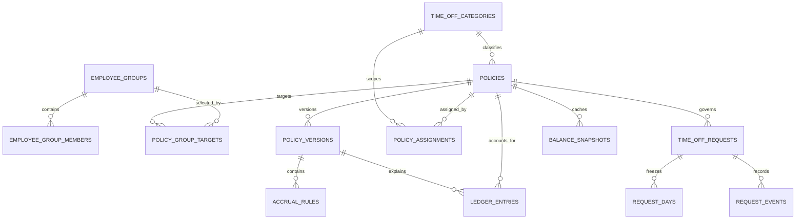
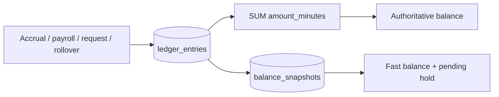

# Data model

This guide sits beside [`models.py`](models.py), the SQLAlchemy source of truth. Schema changes are explained in the [migration map](../migrations/README.md).

## Core relationships

- Company and employee records remain in the assumed services; local rows store stable IDs or a demo projection.
- A request-to-ledger relationship is logical through source IDs, preserving append-only accounting.

## Table map

| Table | Purpose | Load-bearing invariant |
| --- | --- | --- |
| `time_off_categories` | Vacation, Sick, Maternity, and other company labels | Name is unique per company. |
| `employee_groups` | Local projection of Employee Service audiences | Name is unique per company. |
| `employee_group_members` | Local projection of Employee Service membership | An employee belongs to at most one group per company. |
| `policies` | Stable identity for one category policy | Version history hangs from one identity. |
| `policy_group_targets` | Multi-select policy audience | A group targets a policy at most once. |
| `policy_versions` | Effective-dated configuration | Version number and effective date are unique per policy. |
| `accrual_rules` | Time or payroll rates, including tenure tiers | Every rule belongs to exactly one version. |
| `policy_assignments` | Effective-dated policy eligibility materialized from audiences | PostgreSQL excludes overlapping category ranges. |
| `ledger_entries` | Credits, debits, expiry, carryover, and reversal | Source type plus source ID is unique; services never update entries. |
| `balance_snapshots` | Rebuildable balance and pending-hold cache | Ledger wins if the snapshot ever disagrees. |
| `time_off_requests` | Frozen total and workflow status | Status changes only through request service transitions. |
| `request_days` | Charged minutes for each working date | Created once at submission; never repriced. |
| `request_events` | Actor, transition, time, and note | Append-only workflow history. |
| `holidays` | Company non-working dates | Company/date is unique, including observed dates. |
| `job_runs` | Scheduler, payroll, and rollover outcomes | Zero-entry replays remain visible. |
| `demo_state` | Deterministic reviewer clock | One keyed date; production uses the real clock adapter. |

## Accounting view

| Value | Stored as | Why |
| --- | --- | --- |
| Balance movement | Signed integer minutes | Exact across different employee workdays. |
| Policy history | Immutable version rows | Old ledger entries keep their original explanation. |
| Cancellation | Compensating ledger entry | Original debit remains auditable. |
| Request cost | Per-date frozen minutes | Calendar edits cannot silently alter submitted leave. |

## Employee Service projection

`employee_groups` and `employee_group_members` are real tables in this build so the demo can exercise group-targeted policies and database constraints. They are included for completeness, not as a replacement for the assumed Employee Service. In production, that service supplies group definitions and membership changes; this application stores the stable IDs needed to reconcile effective-dated policy eligibility.
