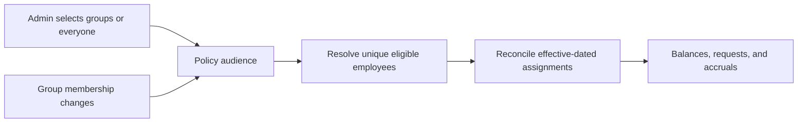
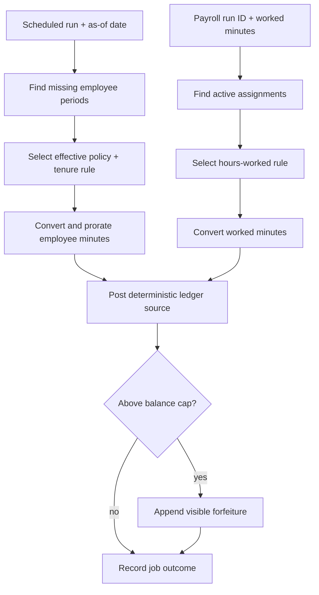
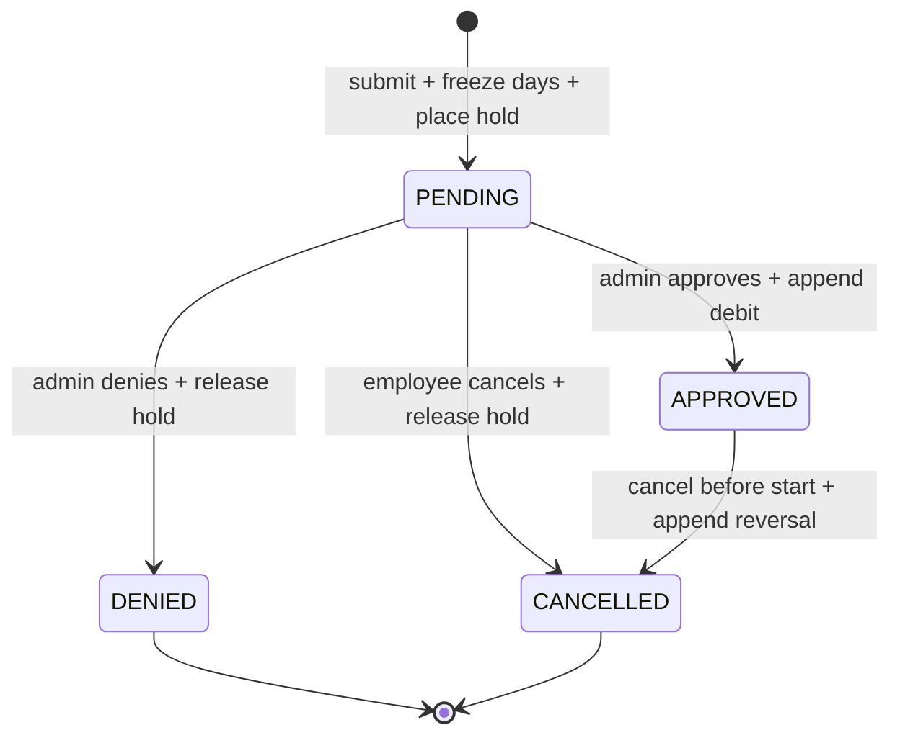
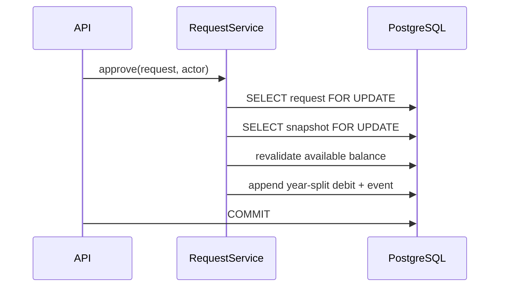

# Transaction services

These modules sit between HTTP routes and pure domain calculations. A route owns commit/rollback; a service owns business invariants and row locks.

## Service map

| Service | Pure rule collaborators | Writes |
| --- | --- | --- |
| [`policy_service.py`](policy_service.py) | [`domain/rules.py`](../domain/rules.py) | Policies, immutable versions, accrual rules |
| [`assignment_service.py`](assignment_service.py) | Effective-date checks | Policy assignments |
| [`group_service.py`](group_service.py) | Audience union and reconciliation | Employee groups, memberships, policy targets, assignments |
| [`accrual_service.py`](accrual_service.py) | [`domain/accrual.py`](../domain/accrual.py), [`domain/periods.py`](../domain/periods.py) | Ledger credits/forfeitures, job runs |
| [`request_service.py`](request_service.py) | [`domain/requests.py`](../domain/requests.py) | Requests, frozen days, events, holds, debit/reversal |
| [`rollover_service.py`](rollover_service.py) | [`domain/rollover.py`](../domain/rollover.py) | Expiry/carryover entries, job runs |
| [`ledger_service.py`](ledger_service.py) | Integer-minute accounting | Ledger entries, rebuildable snapshots |

## Accrual flows

- Employees may belong to multiple groups; audience resolution de-duplicates them.
- Membership changes preserve prior eligibility dates instead of rewriting history.

| Replay boundary | Deterministic identity |
| --- | --- |
| Scheduled period | Assignment + rule + period start |
| Payroll delivery | Payroll run + employee + rule |
| Cap loss | Accrual source plus `:forfeiture` |
| Rollover leg | Employee + policy + year + carryover/expiry leg |

## Request flow

## Transaction guarantees

| Risk | Guard |
| --- | --- |
| Two requests spend the same balance | Snapshot lock plus pending holds. |
| Two admins approve concurrently | Request and snapshot row locks; unique debit source. |
| Balance changes after submission | Approval revalidates under lock. |
| Holiday changes after submission | Approval reads frozen request days. |
| Cross-year cancellation | Debit and reversal use symmetric per-year legs. |
| Retried jobs | Unique source keys turn replays into no-ops. |

Named executable evidence is indexed in [`docs/edge-cases.md`](../../../docs/edge-cases.md).
