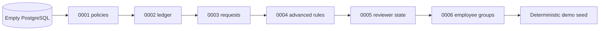

# Schema migrations

Alembic revisions live in [`versions/`](versions/) beside this map. Each migration introduces the schema required by the behavior delivered in the same slice.

## Migration map

| Revision | Behavior introduced | Main objects |
| --- | --- | --- |
| `0001_policies_and_assignments` | Policy catalogue, immutable settings, arbitrary groups | Categories, policies, versions, rules, assignments |
| `0002_accrual_ledger` | Explainable and replay-safe balances | Ledger entries, balance snapshots, job runs |
| `0003_time_off_requests` | Employee/admin workflow | Requests, frozen days, request events |
| `0004_advanced_time_off_rules` | Holidays, caps, carryover, expiration, tenure | Holiday and advanced policy fields |
| `0005_reviewer_experience` | Company-scoped job history and deterministic demo clock | Job-run scope, demo state |
| `0006_employee_groups` | Employee Service group projection and policy audiences | Groups, memberships, group targets, all-employee flag |

## Fresh database



```bash
make up
make migrate
make seed
```

## Authoring rules

| Rule | Reason |
| --- | --- |
| Add schema beside its first behavior | Avoid speculative tables and dead settings. |
| Keep revisions forward-only | Review and deployment history stay explicit. |
| Use database constraints for concurrency invariants | Application checks alone can race. |
| Verify from an empty database | An upgraded developer database can hide missing DDL. |
| Keep seed data outside migrations | Production schema history must not depend on demo fixtures. |

Create a revision with `make revision M="short description"`. CI runs `make migrate` against a fresh PostgreSQL service before the test suite.
