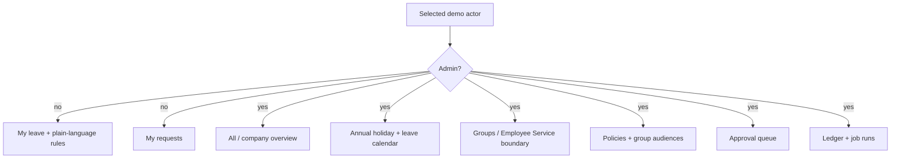
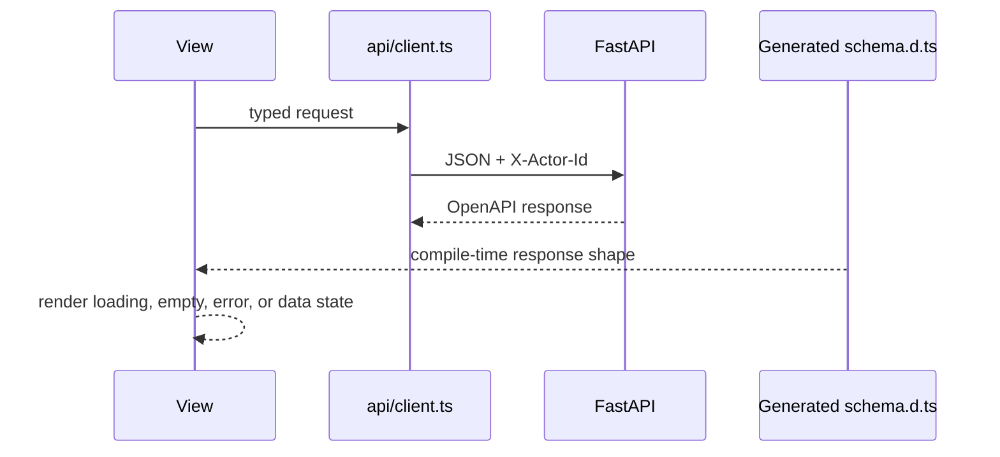

# Web application design

The React/Vite app is a compact reviewer interface over the same server-enforced rules. [`App.tsx`](App.tsx) coordinates views; [`api/client.ts`](api/client.ts) carries the selected demo actor.

## Role-aware navigation

- Navigation removes irrelevant actions; the API independently repeats every access check.
- Switching actors refetches balances and requests under the new server-side scope.
- Accounting remains minute-based, while the UI converts values to days and hours using each employee's workday.

## View map

| View | Reads | Actions |
| --- | --- | --- |
| My leave | Category balances, available time, holds, earning and carryover rules | Start a request |
| My requests | Own request history and events | Preview, partial-day or custom-type submit, cancel |
| Calendar | Holidays plus approved and pending team leave | Jump from the event index to a month |
| Groups (Employee Service) | Employees and reusable company groups | Reference UI for creating groups and placing each employee in at most one group; production membership comes from Employee Service |
| Policies | Categories, policies, versions, groups, holidays | Create or version policies, target all employees or multiple groups, sync holidays |
| Approvals | Company pending requests and events | Approve or deny |
| Audit | Filtered ledger and job runs | Select employee/policy |

## Data flow

| File | Responsibility |
| --- | --- |
| [`App.tsx`](App.tsx) | Role switcher, page state, forms, and audit presentation |
| [`api/client.ts`](api/client.ts) | Fetch wrapper, demo identity header, normalized API errors |
| [`api/types.ts`](api/types.ts) | Ergonomic aliases to generated response schemas |
| [`api/schema.d.ts`](api/schema.d.ts) | Generated OpenAPI TypeScript declarations; never hand-edit |
| [`App.test.tsx`](App.test.tsx) | Reviewer-critical role and policy-control behavior |
| [`index.css`](index.css) | Responsive layout, accessible focus states, status colors, and component styling |

Run `npm run test`, `npm run lint`, `npm run typecheck`, and `npm run build` from this package, or `make check` from the repository root.
