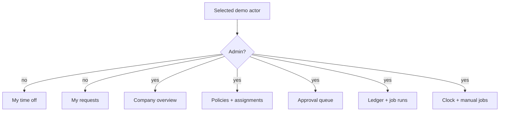
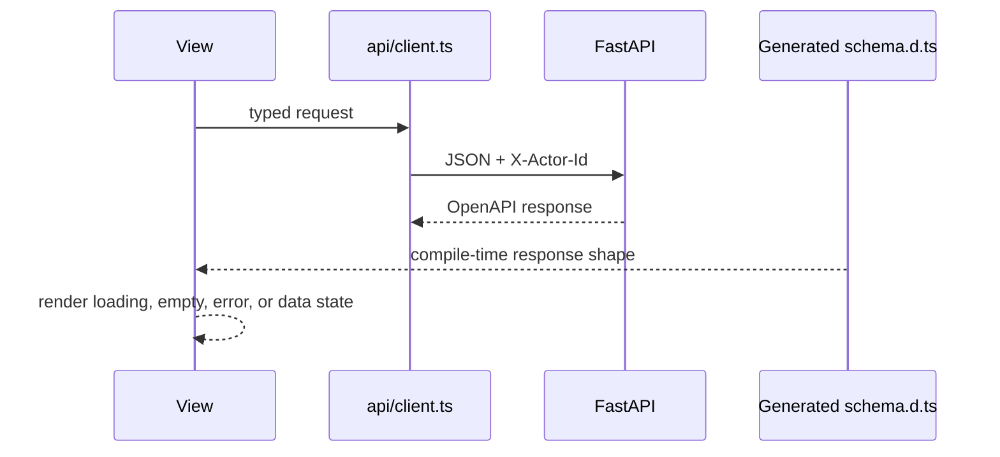

# Web application design

The React/Vite app is a compact reviewer interface over the same server-enforced rules. [`App.tsx`](App.tsx) coordinates views; [`api/client.ts`](api/client.ts) carries the selected demo actor.

## Role-aware navigation

- Navigation removes irrelevant actions; the API independently repeats every access check.
- Switching actors refetches balances and requests under the new server-side scope.

## View map

| View | Reads | Actions |
| --- | --- | --- |
| My time off | Category balances, available minutes, holds | None |
| My requests | Own request history and events | Preview, partial-day submit, cancel |
| Policies | Categories, policies, versions, holidays | Create or version policies, configure either accrual method, assign employees, sync holidays |
| Approvals | Company pending requests and events | Approve or deny |
| Audit | Filtered ledger and job runs | Select employee/policy |
| Demo | Simulated date and job results | Move clock, run accrual or rollover |

## Data flow

| File | Responsibility |
| --- | --- |
| [`App.tsx`](App.tsx) | Role switcher, page state, forms, and audit presentation |
| [`api/client.ts`](api/client.ts) | Fetch wrapper, demo identity header, normalized API errors |
| [`api/types.ts`](api/types.ts) | Ergonomic aliases to generated response schemas |
| [`api/schema.d.ts`](api/schema.d.ts) | Generated OpenAPI TypeScript declarations; never hand-edit |
| [`App.test.tsx`](App.test.tsx) | Reviewer-critical role and policy-control behavior |
| [`index.css`](index.css) | Tailwind import and small global presentation rules |

Run `npm run test`, `npm run lint`, `npm run typecheck`, and `npm run build` from this package, or `make check` from the repository root.
